# h2
  
*All of the following excercises must be done using Salt states*

*(Tiistai)*
  

## b)
*Have user homepages running on Apache*

I set up salt-minion the same way as [previously](https://github.com/juhavee/configuration-management/blob/master/h1.md). Salt-master was already set up.

After testing the master-minion -connection I started the excercise. Having done this once before I used [these](http://terokarvinen.com/2018/apache-user-homepages-automatically-salt-package-file-service-example) instructions to help me remember how it was done.

I started by creating a new folder into /srv/salt

    sudo mkdir /srv/salt/apache

and within the folder, init.sls -file.

    sudoedit /srv/salt/apache/init.sls

    apache2:
      pkg.installed        
  

    sudo salt '*' state.apply apache

I decided to do this in parts so that I could be sure that everything worked. Installing Apache was the first step.
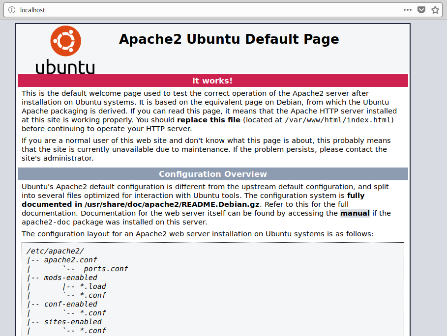
*Apache works*

Next I created another index.html file to replace the Apache default page.

    sudoedit /srv/salt/apache/index.html
  
    terve!  
  

    sudoedit /srv/salt/apache/init.sls
  
    /var/www/html/index.html:
      file.managed:
        - source: salt://apache/index.html
  

    sudo salt '*' state.apply apache
  
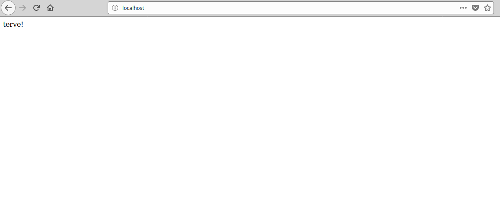

In order to have individual websites for users I had to enable Apaches userdir -module. Normally this is done with a2enmod userdir -command. I could have ran shell command from state, but apparently that can be a bit unreliable so I had to figure out what a2enmod userdir does. To do this I disabled and re-enabled userdir (Apache has to be restarted for the changes to take apply)

    sudo a2dismod userdir
    sudo systemctl restart apache2
      
 
    sudo a2enmod userdir
    sudo systemctl restart apache2

and ran the following command, which I got from [here](https://github.com/terokarvinen/sirotin/blob/master/latest.sh)

    sudo find /etc/ -printf "%T+ %p\n"|sort|tail -15

This shows the latest changes that took place within etc -folder. The last three lines looked like this:

    2018-11-04+20:41:12.5033862140 /etc/apache2/mods-enabled
    2018-11-04+20:41:12.5033862140 /etc/apache2/mods-enabled/userdir.conf
    2018-11-04+20:41:12.5033862140 /etc/apache2/mods-enabled/userdir.load
    
I also checked /etc/apache2/mods-enabled -folder before and after enabling userdir module.

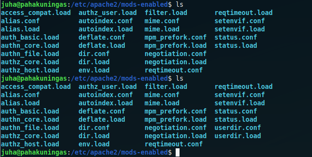

As far as I understand the files in /mods-enabled are symbolic links linking to files in /mods-available and since I wasnt' using a2enmod userdir -command, I had to create the links by hand.

    sudoedit /srv/salt/apache/init.sls    
    
    /etc/apache2/mods-enabled/userdir.conf:
      file.symlink:
        - target: ../mods-available/userdir.conf

    /etc/apache2/mods-enabled/userdir.load:
      file.symlink:
        - target: ../mods-available/userdir.load
        
        
    sudo salt '*' state.apply apache
    

To test if userdir module was enabled I created public_html and index.html within it into the slave machine by hand and restarted Apache, also by hand.

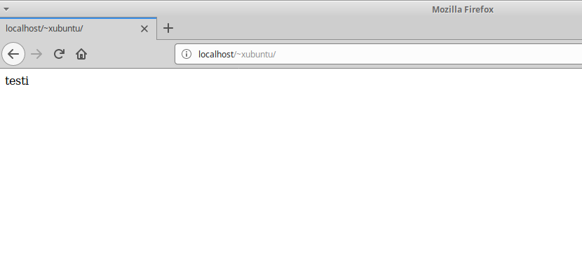
*Great!*

Now I wanted to Apache to restart automatically.

    sudoedit /srv/salt/apache/init.sls

    apache2service:
      service.running:
        - name: apache2
        - watch:
          - file: /etc/apache2/mods-enabled/userdir.conf
          - file: /etc/apache2/mods-enabled/userdir.load
          
This watches userdir.conf and userdir.load. If changes are detected Apache restarts.
 
Before I applied the state I disabled userdir module from the slave,
 
    sudo a2dismod userdir
    
restarted Apache

    sudo systemctl restart apache2
    
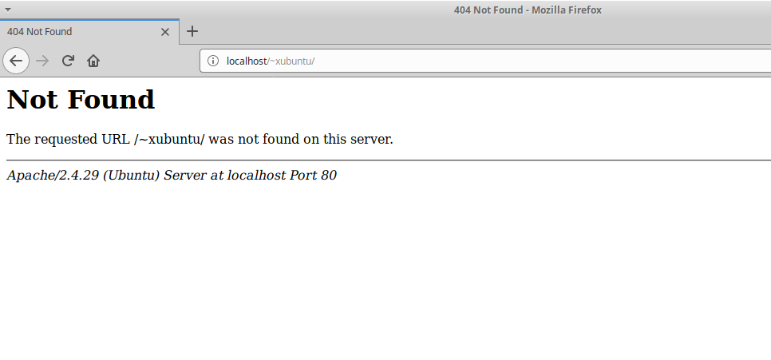

and then, applied the state.

    sudo salt '*' state.apply apache

After refreshing the browser, the 404 was gone and my test page was back up.

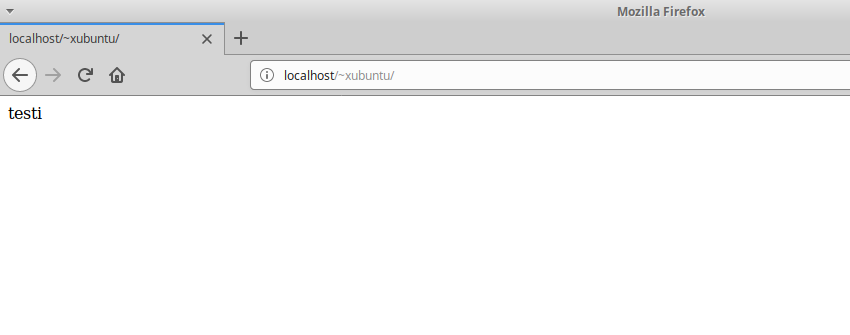

Finally I wanted to apply the whole state in one go. I purged Apache from the slave

    sudo systemctl stop apache2.service
    sudo apt purge apache2
    sudo rm /var/www/html/index.html
    
    
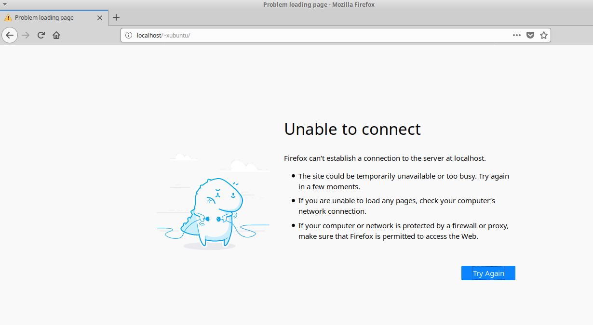    
    
and applied the state

    sudo salt '*' state.apply apache

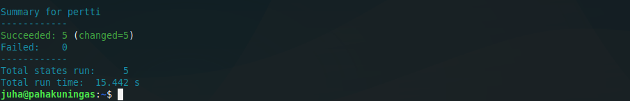
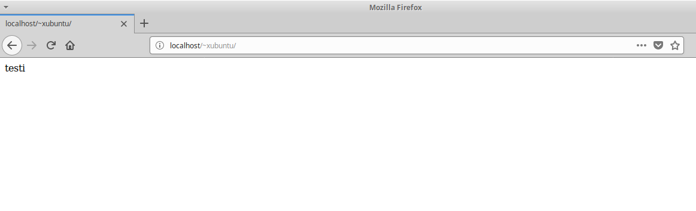

Everything succeeded and the test page looked as it should.

Here's the whole /apache/init.sls

    apache2:
      pkg.installed

    /var/www/html/index.html:
      file.managed:
        - source: salt://apache/index.html

    /etc/apache2/mods-enabled/userdir.conf:
     file.symlink:
       - target: ../mods-available/userdir.conf

    /etc/apache2/mods-enabled/userdir.load:
     file.symlink:
       - target: ../mods-available/userdir.load

    apache2service:
     service.running:
       - name: apache2
       - watch:
         - file: /etc/apache2/mods-enabled/userdir.conf
         - file: /etc/apache2/mods-enabled/userdir.load

  

https://github.com/juhavee/configuration-management/blob/master/h1.md

http://terokarvinen.com/2018/apache-user-homepages-automatically-salt-package-file-service-example

https://github.com/terokarvinen/sirotin/blob/master/latest.sh

  
  
## c)
*Have PHP working with userpages*

I hadn't installed PHP in a while so I used my own old [excercise](https://wordpress.com/post/juhaveijalainen.wordpress.com/51) as a guide.

To get PHP working I needed to:

- install libapache2-mod-php
- comment out ifModule in php7.2.conf
- restart Apache

First I created php directory into /srv/salt

    sudo mkdir /srv/salt/php

and init.sls within /php. This installs php -module.

    sudoedit /srv/salt/php/init.sls    

    libapache2-mod-php:
      pkg.installed

I then applied the state.

    sudo salt '*' state.apply php 
    
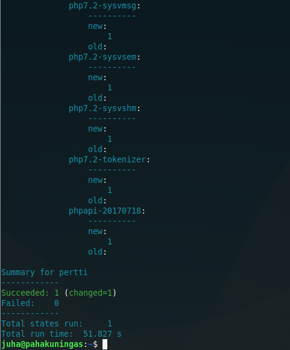
*Looking good*

    sudo cp /etc/apache2/mods-available/php7.2.conf /srv/salt/php/ 

    sudoedit /srv/salt/php/init.sls   
    
    /etc/apache2/mods-available/php7.2.conf:
      file.managed:
        - source: salt://php/php7.2.conf 
        
    sudo salt '*' state.apply php
    
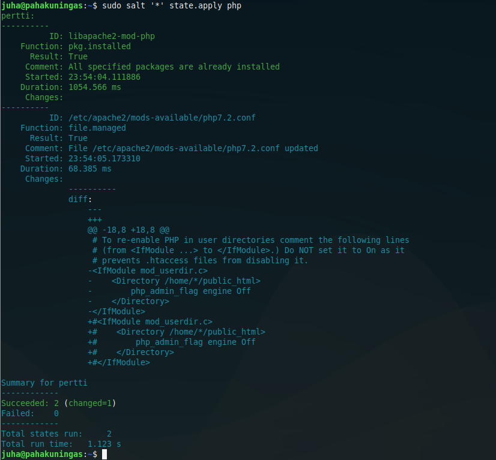    
    
Slave:    

    sudo systemctl restart apache2
    
    nano public_html/index.html
        <?php print(2+2) ?>
        
    mv /public_html/index.html /public_html/index.php
    
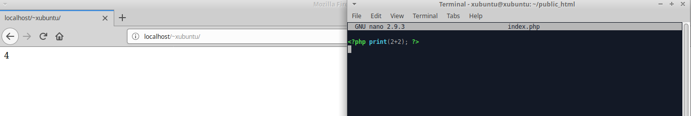

    sudoedit /srv/salt/php/init.sls
    
    apache2service:
      service.running:
        - name: apache2
        - watch:
          - file: /etc/apache2/mods-available/php7.2.conf
          
    sudo salt '*' state.apply php

I purged apache and libapache2-mod-php from the slave and applied the state. I had some trouble to get it working but after a little bit more through purging php started working again. I'm not sure if I should use /mods-available or /mods-enabled to place php7.2.conf into, both seem to be working. Or maybe symlinks like before with Apache would be the best way to do this. 

Here's the whole /php/init.sls:

    libapache2-mod-php:
      pkg.installed

    /etc/apache2/mods-available/php7.2.conf:
      file.managed:
        - source: salt://php/php7.2.conf

    apache2service:
      service.running:
        - name: apache2
        - watch:
          - file: /etc/apache2/mods-available/php7.2.conf

  

https://wordpress.com/post/juhaveijalainen.wordpress.com/51
  
  
## d)
*Set up name-based virtual hosting with Apache*

  

  
  
## e)
*Create example homepage for new users*

  

  
  
## f)
*Use Package-File-Service to change settings*

  

  
  
***

Course page: http://terokarvinen.com/2018/aikataulu-%E2%80%93-palvelinten-hallinta-ict4tn022-3004-ti-ja-3002-to-%E2%80%93-loppukevat-2018-5p

  

Master:

- Lenovo Ideapad 720s
- Dual boot Win 10 | Xubuntu 18.04.1 LTS
- Intel Core i7-8550U
- GeForce MX150
- 8 GB RAM
- 500 GB SSD
  

Slave:

Some old Samsung laptop running live Xubuntu 18.04.1

