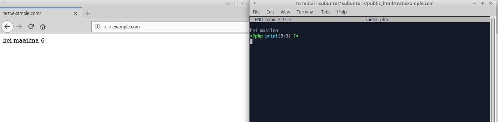
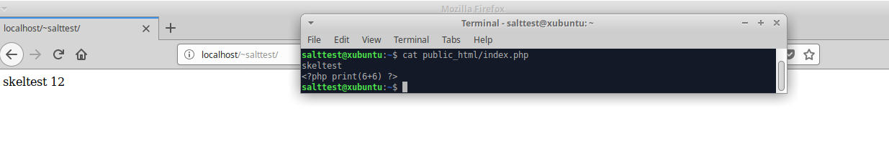
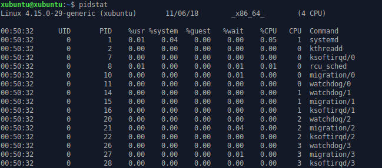

# h2
  

*(Tiistai)*

*All of the following excercises must be done using Salt states*
  

## b)
### *Have user homepages running on Apache*
  

I set up salt-minion the same way as [previously](https://github.com/juhavee/configuration-management/blob/master/h1.md). Salt-master was already set up.

After testing the master-minion -connection I started the excercise. Having done this once before I used [these](http://terokarvinen.com/2018/apache-user-homepages-automatically-salt-package-file-service-example) instructions to help me remember how it was done.

I started by creating a new folder into /srv/salt

    sudo mkdir /srv/salt/apache

and within the folder, init.sls -file.

    sudoedit /srv/salt/apache/init.sls

    apache2:
      pkg.installed        
  

    sudo salt '*' state.apply apache

I decided to do this in parts so that I could be sure that everything worked. Installing Apache was the first step.

*Apache works*

Next I created another index.html file to replace the Apache default page.

    sudoedit /srv/salt/apache/index.html
  
    terve!  
  

    sudoedit /srv/salt/apache/init.sls
  
    /var/www/html/index.html:
      file.managed:
        - source: salt://apache/index.html
  

    sudo salt '*' state.apply apache
  

In order to have individual websites for users I had to enable Apaches userdir -module. Normally this is done with a2enmod userdir -command. I could have ran shell command from state, but apparently that can be a bit unreliable so I had to figure out what a2enmod userdir does. To do this I disabled and re-enabled userdir (Apache has to be restarted for the changes to take apply)

    sudo a2dismod userdir
    sudo systemctl restart apache2
      
 
    sudo a2enmod userdir
    sudo systemctl restart apache2

and ran the following command, which I got from [here](https://github.com/terokarvinen/sirotin/blob/master/latest.sh)

    sudo find /etc/ -printf "%T+ %p\n"|sort|tail -15

This shows the latest changes that took place within etc -folder. The last three lines looked like this:

    2018-11-04+20:41:12.5033862140 /etc/apache2/mods-enabled
    2018-11-04+20:41:12.5033862140 /etc/apache2/mods-enabled/userdir.conf
    2018-11-04+20:41:12.5033862140 /etc/apache2/mods-enabled/userdir.load
    
I also checked /etc/apache2/mods-enabled -folder before and after enabling userdir module.

As far as I understand the files in /mods-enabled are symbolic links linking to files in /mods-available and since I wasnt' using a2enmod userdir -command, I had to create the links by hand.

    sudoedit /srv/salt/apache/init.sls    
    
    /etc/apache2/mods-enabled/userdir.conf:
      file.symlink:
        - target: ../mods-available/userdir.conf

    /etc/apache2/mods-enabled/userdir.load:
      file.symlink:
        - target: ../mods-available/userdir.load
        
        
    sudo salt '*' state.apply apache
    

To test if userdir module was enabled I created public_html and index.html within it into the slave machine by hand and restarted Apache, also by hand.

*Great!*

Now I wanted to Apache to restart automatically.

    sudoedit /srv/salt/apache/init.sls

    apache2service:
      service.running:
        - name: apache2
        - watch:
          - file: /etc/apache2/mods-enabled/userdir.conf
          - file: /etc/apache2/mods-enabled/userdir.load
          
This watches userdir.conf and userdir.load. If changes are detected Apache restarts.
 
Before I applied the state I disabled userdir module from the slave,
 
    sudo a2dismod userdir
    
restarted Apache

    sudo systemctl restart apache2
    

and then, applied the state.

    sudo salt '*' state.apply apache

After refreshing the browser, the 404 was gone and my test page was back up.

Finally I wanted to apply the whole state in one go. I purged Apache from the slave

    sudo systemctl stop apache2.service
    sudo apt purge apache2
    sudo rm /var/www/html/index.html
    
    
    
    
and applied the state

    sudo salt '*' state.apply apache

Everything succeeded and the test page looked as it should.

Here's the whole /apache/init.sls

    apache2:
      pkg.installed

    /var/www/html/index.html:
      file.managed:
        - source: salt://apache/index.html

    /etc/apache2/mods-enabled/userdir.conf:
     file.symlink:
       - target: ../mods-available/userdir.conf

    /etc/apache2/mods-enabled/userdir.load:
     file.symlink:
       - target: ../mods-available/userdir.load

    apache2service:
     service.running:
       - name: apache2
       - watch:
         - file: /etc/apache2/mods-enabled/userdir.conf
         - file: /etc/apache2/mods-enabled/userdir.load

  

https://github.com/juhavee/configuration-management/blob/master/h1.md

http://terokarvinen.com/2018/apache-user-homepages-automatically-salt-package-file-service-example

https://github.com/terokarvinen/sirotin/blob/master/latest.sh

  
  
## c)
### *Set up PHP to work with userpages*
  

I hadn't installed PHP in a while so I used my own old [excercise](https://wordpress.com/post/juhaveijalainen.wordpress.com/51) as a guide.

To get PHP working I needed to:

- install libapache2-mod-php
- comment out ifModule in php7.2.conf
- restart Apache

First I created php directory into /srv/salt

    sudo mkdir /srv/salt/php

and init.sls within /php. This installs php -module.

    sudoedit /srv/salt/php/init.sls    

    libapache2-mod-php:
      pkg.installed

I then applied the state.

    sudo salt '*' state.apply php 
    

*Looking good*

I copied existing php7.2.conf file where ifModule was already commented out into /srv/salt/php and set it to overwrite the conf file in the slave machine.

    sudo cp /etc/apache2/mods-available/php7.2.conf /srv/salt/php/ 

    sudoedit /srv/salt/php/init.sls   
    
    /etc/apache2/mods-available/php7.2.conf:
      file.managed:
        - source: salt://php/php7.2.conf 
        
    sudo salt '*' state.apply php
    
    
    
After ifModule was disabled I manually restarted Apache on the slave,    

    sudo systemctl restart apache2
    
wrote some php    
    
    nano public_html/index.html
        <?php print(2+2) ?>

and renamed index.html into index.php.

    mv /public_html/index.html /public_html/index.php
    

*Here's the result*

And finally, I set Apache to restart whenever changes in php7.2.conf were detected.

    sudoedit /srv/salt/php/init.sls
    
    apache2service:
      service.running:
        - name: apache2
        - watch:
          - file: /etc/apache2/mods-available/php7.2.conf
          
    sudo salt '*' state.apply php

I purged apache and libapache2-mod-php from the slave and applied the state. I had some trouble to get it working but after a little bit more through purging php started working again. I'm not sure if I should use /mods-available or /mods-enabled to place php7.2.conf into, both seem to be working. Or maybe symlinks like with Apache before would be the best way to do this? 

Here's the whole /php/init.sls:

    libapache2-mod-php:
      pkg.installed

    /etc/apache2/mods-available/php7.2.conf:
      file.managed:
        - source: salt://php/php7.2.conf

    apache2service:
      service.running:
        - name: apache2
        - watch:
          - file: /etc/apache2/mods-available/php7.2.conf

  

https://wordpress.com/post/juhaveijalainen.wordpress.com/51
  
  
## d)
### *Set up name-based virtual hosting with Apache*
  

I used Tero's [instructions](http://terokarvinen.com/2018/name-based-virtual-hosts-on-apache-multiple-websites-to-single-ip-address) as a support.
To set up name-based virtual hosting with Apache I had to:

- create a new conf file into /apache2/sites-available
- create a symlink into /apache2/sites-enabled
- restart Apache
- create example website (using the slave)
- add example website into /etc/hosts

I decided to incorporate this into the Apache state. I started with the conf file.

    sudoedit /srv/salt/apache/test.example.com.conf

    <VirtualHost *:80>
     ServerName test.example.com
     ServerAlias www.test.example.com

     DocumentRoot /home/xubuntu/public_html/test.example.com

     <Directory /home/xubuntu/public_html/test.example.com>
       Require all granted
     </Directory>
    </VirtualHost>

  

    sudo cp /etc/hosts /srv/salt/apache
    
    sudoedit /srv/salt/apache/hosts
    
        127.0.0.1	localhost
        127.0.0.1	test.example.com

        # The following lines are desirable for IPv6 capable hosts
        ::1     ip6-localhost ip6-loopback
        fe00::0 ip6-localnet
        ff00::0 ip6-mcastprefix
        ff02::1 ip6-allnodes
        ff02::2 ip6-allrouters

    
  

    sudoedit /srv/salt/apache/init.sls

    apache2:
      pkg.installed

    /var/www/html/index.html:
     file.managed:
       - source: salt://apache/index.html

    /etc/apache2/mods-enabled/userdir.conf:
     file.symlink:
       - target: ../mods-available/userdir.conf

    /etc/apache2/mods-enabled/userdir.load:
     file.symlink:
       - target: ../mods-available/userdir.load

    /etc/apache2/sites-available/test.example.com.conf:
      file.managed:
        - source: salt://apache/test.example.com.conf

    /etc/apache2/sites-enabled/test.example.com.conf:
      file.symlink:
        - target: ../sites-available/test.example.com.conf
        
    /etc/hosts:
      file.managed:
        - source: salt://apache/hosts

    apache2service:
     service.running:
       - name: apache2
       - watch:
         - file: /etc/apache2/mods-enabled/userdir.conf
         - file: /etc/apache2/mods-enabled/userdir.load
         - file: /etc/apache2/sites-enabled/test.example.com.conf

  

    sudo salt '*' state.apply apache

I created /public_html/test.example.com folder and an index file within it manually.

*And here are the results*

  

http://terokarvinen.com/2018/name-based-virtual-hosts-on-apache-multiple-websites-to-single-ip-address
  
  
## e)
### *Create example homepage for new users*
  

I used Salts own [instructions](https://docs.saltstack.com/en/latest/ref/states/all/salt.states.file.html#salt.states.file.directory) on how to create directories.

    sudo mkdir /srv/salt/skel
    
    sudoedit /srv/salt/skel/init.sls
    
    /etc/skel/public_html:
      file.directory:
        - makedirs: True

    /etc/skel/public_html/index.php:
      file.managed:
        - source: salt://skel/index.php
        
          

    sudoedit /srv/salt/skel/index.php
        
        skeltest
        <?php print(6+6) ?>

      

    sudo salt '*' state.apply skel

I created a new user on the slave and used the browser to navigate to the new users website to check if the skel -state worked.

*Looks like it did.*

  

https://docs.saltstack.com/en/latest/ref/states/all/salt.states.file.html#salt.states.file.directory
  
  
## f)
### *Use Package-File-Service to change settings*
  

I decided to install and configure Sysstat. I used one of my previous [assingments](https://juhaveijalainen.wordpress.com/2018/02/26/h5/) as a reference.

    sudo mkdir /srv/salt/sysstat
    sudo cp /etc/default/sysstat /srv/salt/sysstat
    
   
    sudoedit /srv/salt/sysstat/init.sls

    sysstat:
      pkg.installed

    /etc/default/sysstat:
      file.managed:
        - source: salt://sysstat/sysstat

    sysstatservice:
      service.running:
        - name: sysstat
        - watch:
          -file: /etc/default/sysstat

    sudo salt '*' state.apply sysstat
 
 

  

https://juhaveijalainen.wordpress.com/2018/02/26/h5/
  
  
***

Course page: http://terokarvinen.com/2018/aikataulu-%E2%80%93-palvelinten-hallinta-ict4tn022-3004-ti-ja-3002-to-%E2%80%93-loppukevat-2018-5p

https://github.com/juhavee/configuration-management/blob/master/h1.md

http://terokarvinen.com/2018/apache-user-homepages-automatically-salt-package-file-service-example

https://github.com/terokarvinen/sirotin/blob/master/latest.sh

https://wordpress.com/post/juhaveijalainen.wordpress.com/51

http://terokarvinen.com/2018/name-based-virtual-hosts-on-apache-multiple-websites-to-single-ip-address

https://docs.saltstack.com/en/latest/ref/states/all/salt.states.file.html#salt.states.file.directory

https://juhaveijalainen.wordpress.com/2018/02/26/h5/

  

Master:

- Lenovo Ideapad 720s
- Dual boot Win 10 | Xubuntu 18.04.1 LTS
- Intel Core i7-8550U
- GeForce MX150
- 8 GB RAM
- 500 GB SSD
  

Slave:

Some old Samsung laptop running live Xubuntu 18.04.1

