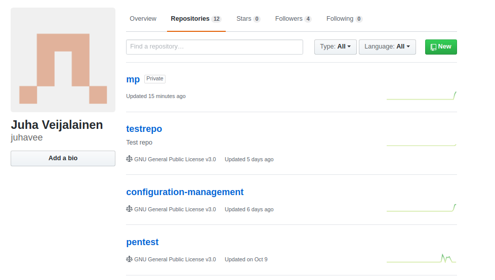
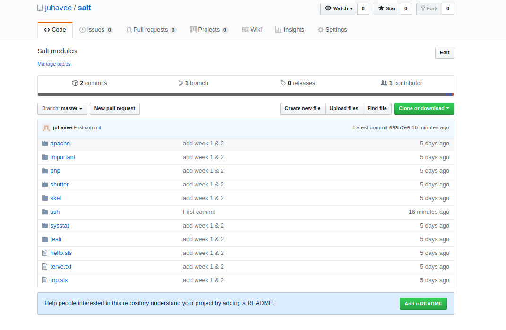
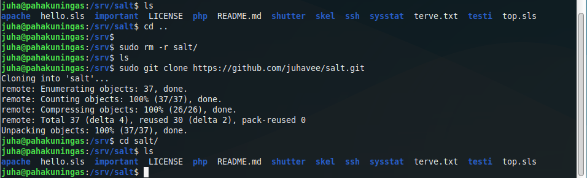
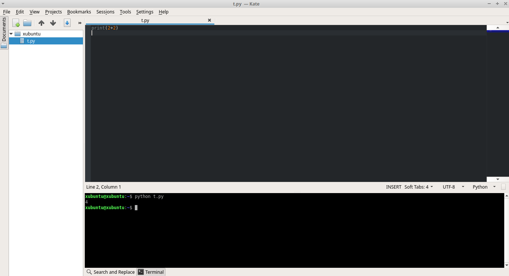
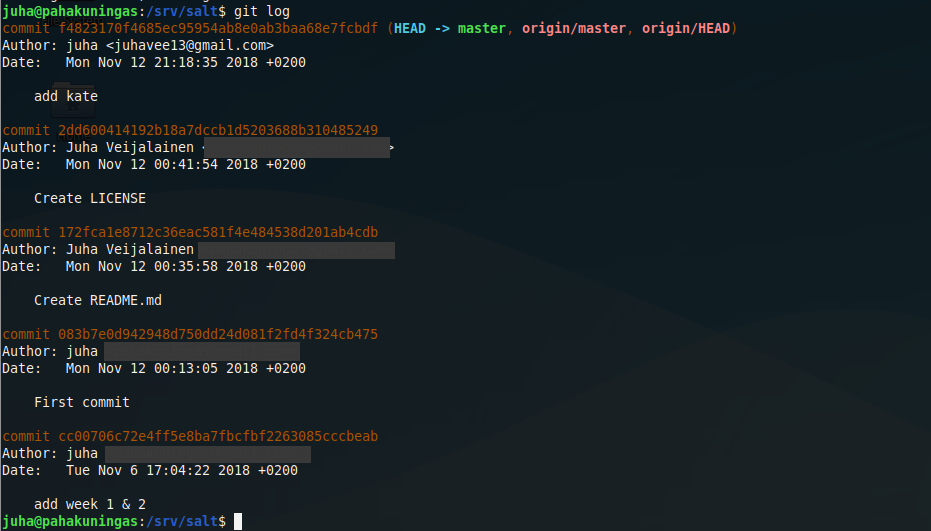
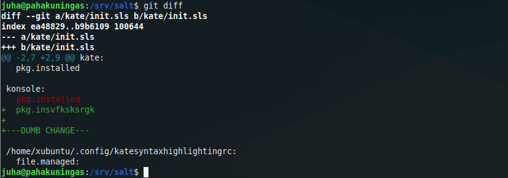
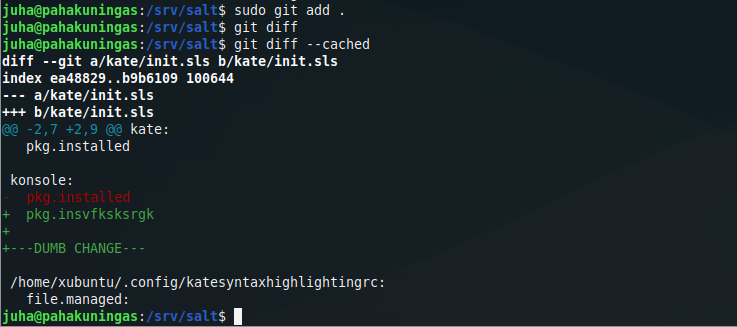
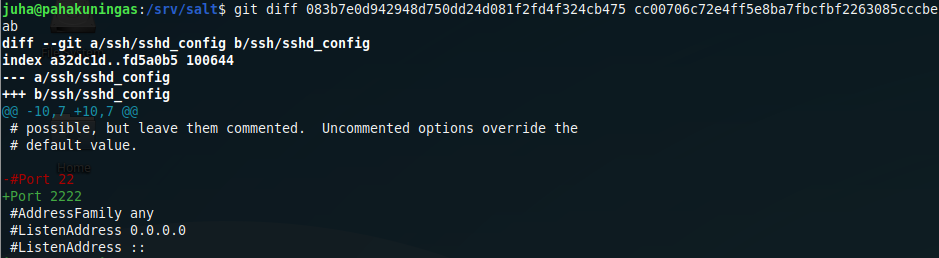
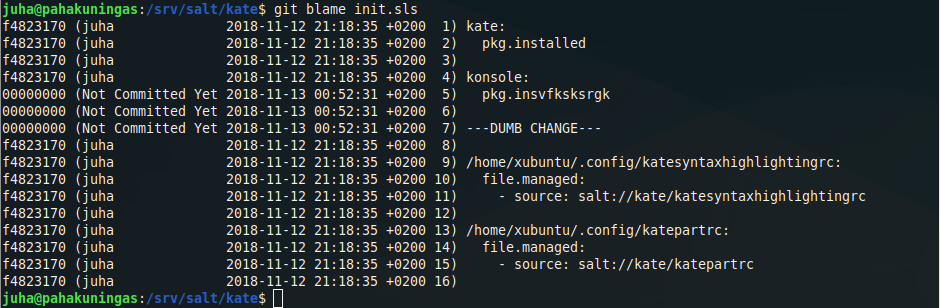

# h3
  

  
## c)
### *Upload /srv/salt into Github and clone it to your computer*
  
  
I followed [these](https://help.github.com/articles/adding-an-existing-project-to-github-using-the-command-line/) instructions on how to add existing project into Github. 

Firtst step was to create an empty repo into Github.

I started by clicking the green "New" button under the "Repositories" -tab. The instructions said that initializing the repository with README, licence or gitignore files could lead to errors and should be added after pushing the project into Github, so I didn't do any of that. 

Next I initialized the salt folder in /srv/salt,

	cd /srv/salt
	sudo git init

added the files within /salt to the local repository

	sudo git add .

committed the files with very original "First commit" message,

	sudo git commit -m "First commit"
	
added the url for the remote repository that I just created. The url is the repos url with .git added to the end.	
	
	sudo git remote add origin https://github.com/juhavee/salt.git

and pushed the changes to Github.

	sudo git push -u origin master
	

As you can see from the dates in the screenshot, I had initialized and made changes to the files earlier. For that reason the "First commit" message ended up applying only to a small change I made to a file in the ssh folder just a bit before I started doing this assignment.

Before moving on I created README and LICENCE files.

#### Cloning a repository

To clone the repository I had to first delete salt folder

	cd /srv
	 sudo rm -r salt/
	 
and after checking that it was gone I cloned it from Github with

	 sudo git clone https://github.com/juhavee/salt.git
	 

   
  
https://help.github.com/articles/adding-an-existing-project-to-github-using-the-command-line/
  
  
## f)
### *Create a new Salt-module*
  
  
I created a module that installs [Kate](https://kate-editor.org/) and [Konsole](https://konsole.kde.org/), which enables Kates console plugin. I also configured Kate to default to dark theme.

 I installed Kate and Konsole on my own computer and after a while of trying to figure out where the config files were I found them at /home/user/.config by switching the theme manually and using
 
 	sudo find /home/ -printf "%T+ %p\n"|sort|tail -15
 	
 command. The files are called "katepartrc" and "katesyntaxhighlightingrc".

I then created a new folder in /srv/salt called kate,
 
 	cd /srv/kate
 	sudo mkdir kate
 	
copied the two files in it
 	
 	cd
 	cd /home/juha/.config
 	sudo cp katepartrc katesyntaxhighlightingrc /srv/salt/kate
 	
and created init.sls.
 
 	sudoedit init.sls
 	
 	kate:
	  pkg.installed

	konsole:
	  pkg.installed

	/home/xubuntu/.config/katesyntaxhighlightingrc:
	  file.managed:
	    - source: salt://kate/katesyntaxhighlightingrc

	/home/xubuntu/.config/katepartrc:
	  file.managed:
	    - source: salt://kate/katepartrc

(Unless you have a bunch of minions with xubuntu as their username, this probably isn't the greatest solution to have the dark theme applied automatically.) 

I tried to apply the state. 

	sudo salt '*' state.apply kate
	
Kate and Konsole didn't have any problems but salt complained that it wasn't able to find the two config files. Using 

	ls -l
	
I figured out that the files didn't have read permissions, so I added them.

	sudo chmod ugo+r katepartrc
	sudo chmod ugo+r katesyntaxhighlightingrc
	 	
After applying kate state again the complaints were gone so I checked the results.

*Looking good!*
  
  
https://kate-editor.org

https://konsole.kde.org
  
  

  
  
## d)
### *Use your Salt-repo to show off 'git log', 'git diff' and 'git blame' -commands*
  
  
#### git log

	git log

shows the commit logs.
	

The commits are in chronological order starting from most recent. Commits are listed with checksum, authors name and email, date and commit message.

HEAD is the commit that the repo is on. It's usually the latest commit but doesn't necessarily have to be.

Master is the default main branch name.

Origin is the default name for main remote repository where you pull from and push to. In this case it refers to a Github repository.

#### git diff

	git diff
	
Compares the latest changes made in a file that aren't yet staged.

Here I made a change to init.sls in /salt/kate. Green text starting with + shows lines that were added, red text starting with - shows lines removed.

After staging the changes

	git diff
	
shows nothing, but

	git diff --cached
	
which compares the differences between staged and already committed files, now shows the changes I made.

 
 
 It is possible to do much more with git diff, for example comparing the differences between commits can be done by using checksums (that you can get with git log). Like this:
 
 	git diff 083b7e0d942948d750dd24d081f2fd4f324cb475 cc00706c72e4ff5e8ba7fbcfbf2263085cccbeab

#### git blame

	git blame <path/to/file>
	
shows the last person that modified a line in a file.

	git blame init.sls

It also displays date and time when the line was changed and whether the change is committed.
  
  
https://www.atlassian.com/git/tutorials/saving-changes/git-diff

https://www.atlassian.com/git/tutorials/inspecting-a-repository/git-blame
  
  
## e)
### *Make a change into git and remove it using 'git reset --hard*
  
  
I previously modified init.sls in /salt/kate and staged the changes but begun to suspect that maybe the changes I made weren't that great after all.

I checked the status of the repo to make sure that there were staged changes that weren't yet committed.

	git status
	

After getting the confirmation I reseted the changes

	 sudo git reset --hard

and made sure that all of the changes were gone

	git status
	git blame init.sls
	git cat init.sls
	

*Everything seems to be back to normal*
  
  
***
  
Course page: http://terokarvinen.com/2018/aikataulu-%E2%80%93-palvelinten-hallinta-ict4tn022-3004-ti-ja-3002-to-%E2%80%93-loppukevat-2018-5p

https://help.github.com/articles/adding-an-existing-project-to-github-using-the-command-line/

https://kate-editor.org

https://konsole.kde.org
  
  
Master:

- Lenovo Ideapad 720s
- Dual boot Win 10 | Xubuntu 18.04.1 LTS
- Intel Core i7-8550U
- GeForce MX150
- 8 GB RAM
- 500 GB SSD
  

Slave:

Some old Samsung laptop running live Xubuntu 18.04.1
