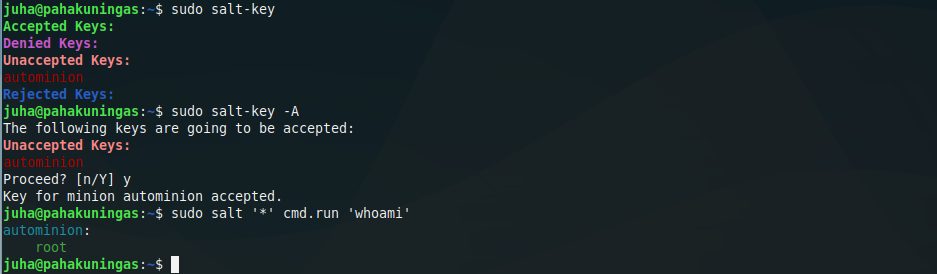
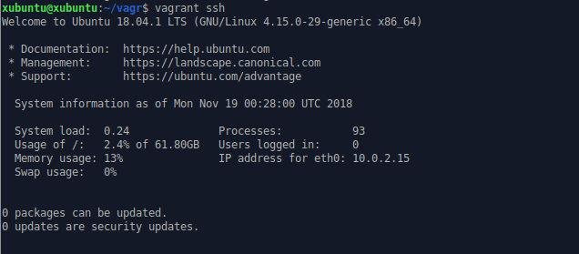
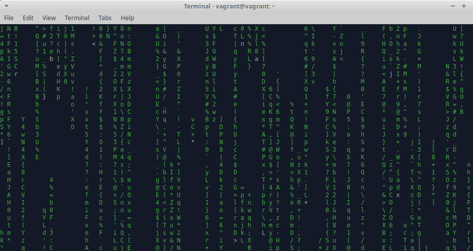

# h4


## a) *Creating a script that turns your computer into salt slave*
<br></br>
<br></br>
I used one of my older school [excercises](https://wordpress.com/post/juhaveijalainen.wordpress.com/90) as a reference and created the following script.

```bash
nano saltminion
#!/bin/bash
sudo apt update
sudo apt install salt-minion -y
echo -e 'master: MASTERS IP ADDRESS\nid: autominion' |sudo tee /etc/salt/minion
sudo systemctl restart salt-minion
```		

The script 

- updates the system
- installs salt-minion
- replaces the wall of text in /etc/salt/minion with	
	
>master: MASTERS IP ADDRESS
>id: autominion

- restarts salt-minion  

I gave the script proper rights and ran it.
```bash
chmod a+x saltminion
./saltminion
```	
To make sure that my script worked I switched to master and checked salt keys,
```bash
sudo salt-key
```
accepted keys
```bash
sudo salt-key -A
```
and tested that there really was a connection between master and slave
```bash
sudo salt '*' cmd.run 'whoami'
```


*Script seems to be working*
<br></br>
<br></br>
https://wordpress.com/post/juhaveijalainen.wordpress.com/90
<br></br>
<br></br>
## c) *Installing Vagrant and trying out an image from Atlas*
<br></br>
<br></br>
I already had Vagrant installed  so decided to do this excercise using a clean Xubuntu 18.04.1 live usb stick.

I begun by installing Vagrant and Virtualbox

	sudo apt install -y vagrant virtualbox
	
and made sure that both worked.
```bash
mkdir vagr
cd vagr/
vagrant init bento/ubuntu-18.04
vagrant up
vagrant ssh
```

```bash
sudo apt update
sudo apt install cmatrix
cmatrix 
```


Now that I could be reasonably sure that everything worked I exited and destroyed the Xubuntu box.
```bash
exit
vagrant destroy
```
I navigated to https://app.vagrantup.com/boxes/search and picked [offensive-security/kali-linux](https://app.vagrantup.com/offensive-security/boxes/kali-linux) to try out.

```bash
mkdir kali
cd kali
vagrant init offensive-security/kali-linux
vagrant up
```
Unfortunately, after a while, the image download failed with the following error code:
>Failed writing body (641 != 16360)

I'm assuming I ran out of disc space since I was using a live usb stick.


<br></br>
<br></br>
https://app.vagrantup.com/boxes/search

https://app.vagrantup.com/offensive-security/boxes/kali-linux
<br></br>
<br></br>
***
<br></br>
Course page: http://terokarvinen.com/2018/aikataulu-%E2%80%93-palvelinten-hallinta-ict4tn022-3004-ti-ja-3002-to-%E2%80%93-loppukevat-2018-5p

https://wordpress.com/post/juhaveijalainen.wordpress.com/90

https://app.vagrantup.com/boxes/search

https://app.vagrantup.com/offensive-security/boxes/kali-linux
<br></br>
<br></br>
- Lenovo Ideapad 720s
- Dual boot Win 10 | Xubuntu 18.04.1 LTS
- Intel Core i7-8550U
- GeForce MX150
- 8 GB RAM
- 500 GB SSD
<br></br>
