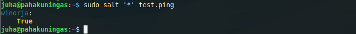
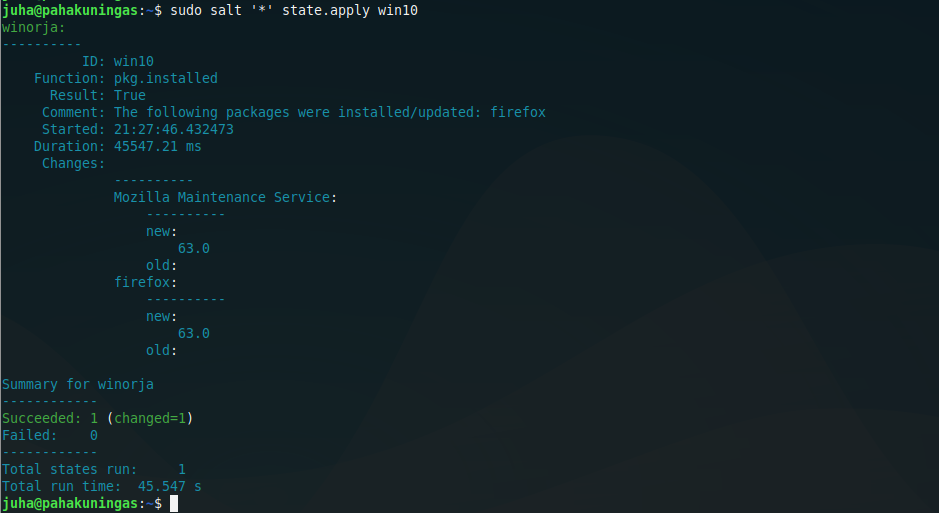
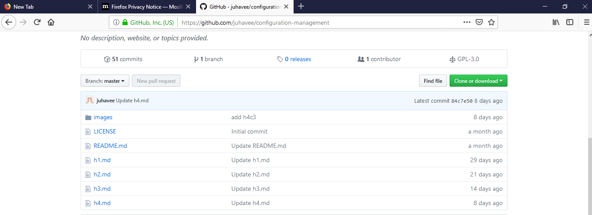
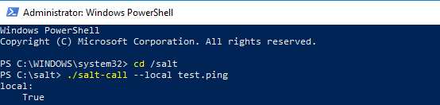
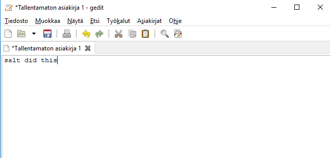
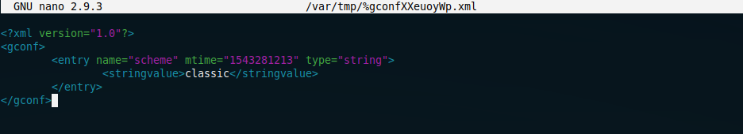
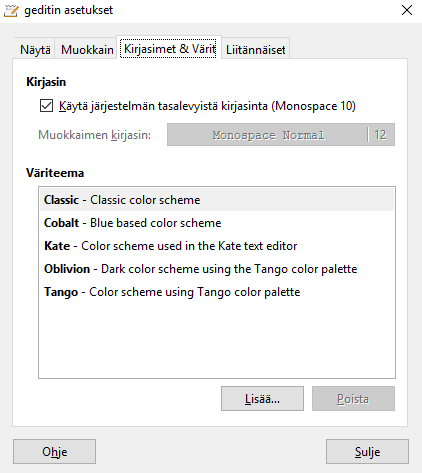
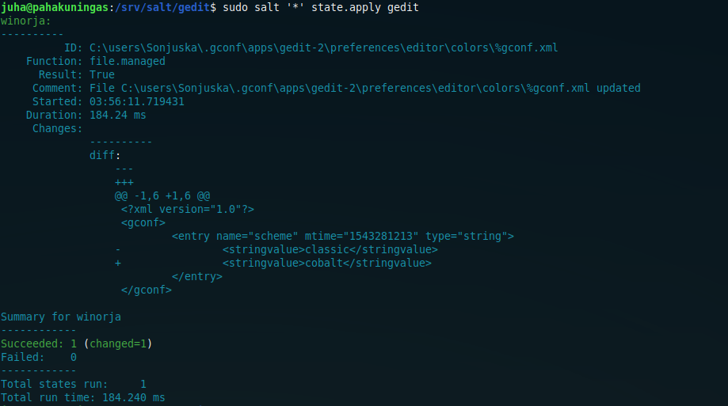
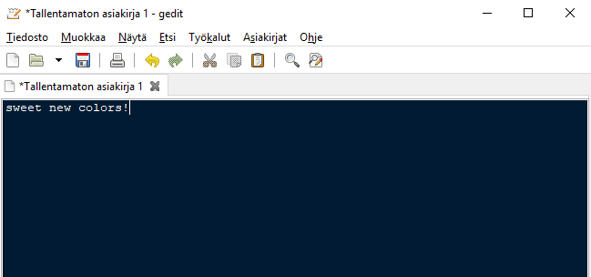

# h5

  
### *Setting up Salt-Minion for Windows*

I started by downloading salt-minion for Windows from http://repo.saltstack.com/windows/. I chose "Salt-Minion-2017.7.4-Py3-AMD64-Setup.exe" because it matches with the version of salt-master I have installed. 

After the download was finished I ran the setup. The setup asked for Master IP and a name for the minion. I entered the IP, which I got from the master machine using

	hostname -I

and named the minion "winorja".

The installer asked if I wanted to install some missing files (dependencies maybe?), I clicked "yes". After the installation was complete the installer asked if I wanted to launch salt-minion. I did.

I switched to master to check if it had recieved winorjas public key.

	sudo salt-key

It had so I accepted the key.

	sudo salt-key -A
	
To make sure that the connection was established I used master to ping the minion.

	sudo salt '*' test.ping
	

  
http://repo.saltstack.com/windows/
  
  
## a) *Controlling Windows with Salt*
  
I decided to install Firefox for Windows. I Used Teros [article](http://terokarvinen.com/2018/control-windows-with-salt) to help me with that.

To be able to install programs to Windows with Salt I first had to enable Salt Windows software repositories. I started by creating a folder called win to /srv/salt.

	sudo mkdir /srv/salt/win
	
I then gave the user "salt" (which salt-master is running as) root privileges for srv/salt/win and gave read, write and execute rights for users and groups for that same folder.	
	
	sudo chown root.salt /srv/salt/win
	sudo chmod ug+rwx /srv/salt/win
	
After that I was able to download the repositories.
	
	sudo salt-run winrepo.update_git_repos

I created a new folder called win10 and init.sls file within it
	
 	sudo mkdir /srv/salt/win10
 	sudoedit /srv/salt/win10/init.sls

 	win10:
	  pkg.installed:
	    - pkgs:
	      - firefox

and applied the state.

	sudo salt '*' state.apply win10

I tested that the Firefox I just installed worked properly by surfing around a bit.

	
  
  
http://terokarvinen.com/2018/control-windows-with-salt
  
  
## b) *Controlling Windows with Salt without master-slave structure*
  
I started by opening Powershell and navigated to salt directory.

	cd /salt

I then tested just pinging locally.

	./salt-call --local test.ping
	
It didn't work. Instead I got back some error messages which, since I already had a guess of the cause for the errors, I didn't bother to read.

Instead I relaunched Powershell, this time as an administrator and entered the same commands as previously. 

Now that I knew salt-call --local was working I decided to install [gedit](https://wiki.gnome.org/Apps/Gedit) using it.

First I had to have the Windows minion to download the Windows software repos. 

Master:

	sudo salt -G 'os:windows' pkg.refresh_db
	
I had to try couple of times to get it working. Once it did

Minion:
	
	salt-call --local pkg.install gedit
	
installed gedit.

	
  
  
http://terokarvinen.com/2018/control-windows-with-salt

https://wiki.gnome.org/Apps/Gedit
  
  
## c) *Configuring settings of a Windows program with Salt*
  
Since I just installed Gedit I figured that I might as well tweak it a little bit by changing its color theme.

After I tried changing colors manually I started looking for the config file. Surprisingly it didn't take too long to find it at C:\users\Sonjuska\.gconf\apps\gedit-2\preferences\editor\colors\%conf.xml

*This is what Gedit config file for color themes looks like*

I created a new folder called gedit on master to /srv/salt and copied the config file there.

When I changed Gedits colors manually I noticed it had a few predefined color themes to choose from.

I opened the conf file,

	sudoedit %gconf.xml

changed "classic" to "cobalt" and created a new init.sls file

	sudoedit init.sls
	
	C:\users\Sonjuska\.gconf\apps\gedit-2\preferences\editor\colors\%gconf.xml:
	  file.managed:
	    - source: salt://gedit/%gconf.xml

and then ran the state.

	sudo salt '*' state.apply gedit

Everything seemed to go well but when I launched Gedit the colors hadn't changed. 

I again changed the color theme manually and noticed that the "mtime" string within %gconf.xml changed too.

So, I changed the colors to cobalt, copied the new "mtime" string to %gconf.xml that I had on the master, changed the color theme back to classic, checked that the conf file changed too and applied the state again.

Even though the conf file was overwritten succesfully it took a little bit of time for Gedit to figure out that the colors should also change but, in the end they did and Gedit had a sweet new color theme.

  
  
***
  
Course page: http://terokarvinen.com/2018/aikataulu-%E2%80%93-palvelinten-hallinta-ict4tn022-3004-ti-ja-3002-to-%E2%80%93-loppukevat-2018-5p

http://repo.saltstack.com/windows/

http://terokarvinen.com/2018/control-windows-with-salt

https://wiki.gnome.org/Apps/Gedit
  
  
Master:
- Lenovo Ideapad 720s
- Dual boot Win 10 | Xubuntu 18.04.1 LTS
- Intel Core i7-8550U
- GeForce MX150
- 8 GB RAM
- 500 GB SSD

Minion:
- some old Samsung laptop
- Windows 10 Home
